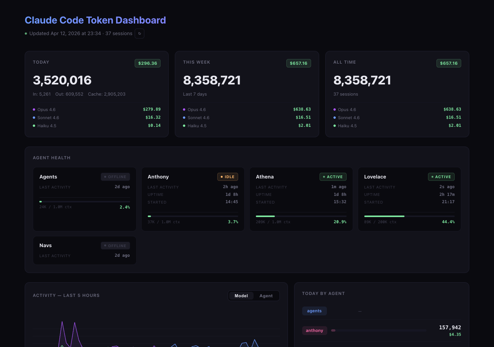

# Claude Code Token Dashboard

A local dashboard that parses your Claude Code session transcripts and shows token usage statistics. No cloud, no API keys — reads the JSONL files Claude Code already writes to your machine.



## Features

- **Today / Week / All-Time stats** at a glance
- **Activity line graph** — last 5 hours at 5-minute resolution, switchable between model and agent views, with hover tooltips
- **7-day bar chart** showing daily token usage trends
- **Per-agent breakdown** — today's usage split by agent/project
- **Usage by model** — all-time token breakdown across Opus, Sonnet, and Haiku
- **Session-level detail** — input, output, cache write, and cache read tokens per session
- **Reactive live server** — Vue 3 powered, polls `/api/data` every 5 minutes and updates in place without a page reload
- **Self-contained static HTML** — zero runtime dependencies, works offline

## Requirements

- Python 3.7+
- Claude Code (the CLI) — reads session files from `~/.claude/projects/`

No pip packages needed. Standard library only.

## Usage

### Live Server (recommended)

```bash
python3 dashboard.py --serve
```

Opens a dashboard at `http://localhost:8080`. The page auto-refreshes every 5 minutes — data updates reactively without reloading. A pulsing indicator and manual refresh button (↻) are shown in the header. Press Ctrl+C to stop.

### Static HTML

```bash
python3 dashboard.py
open token_dashboard.html
```

Generates a self-contained HTML snapshot. Vue still renders the initial data reactively, but polling is disabled since there's no server to query.

### Options

```
python3 dashboard.py                  # Generate static HTML
python3 dashboard.py --serve          # Start live server (default port 8080)
python3 dashboard.py --port 3000      # Custom port
python3 dashboard.py -o report.html   # Custom output path
```

## Layout

```
[ Today ] [ This Week ] [ All Time ]

[ Activity — Last 5 hrs  ] [ Today by Agent  ]
[ Last 7 Days bar chart   ] [ Usage by Model  ]

[ Sessions table ]
```

The activity line graph shows token throughput in 5-minute buckets. Toggle between **Model** (Opus / Sonnet / Haiku) and **Agent** views using the tab in the card header. Hover over the graph to see a tooltip with the exact time and token count for each series at that point.

## How It Works

Claude Code stores session transcripts as JSONL files in `~/.claude/projects/`. Each line contains message data including token usage. This tool:

1. Scans all `.jsonl` files recursively
2. Extracts input, output, and cache tokens from each message
3. Groups them by session and infers the agent/project from the directory path
4. Serves data as JSON via `/api/data`, rendered by a Vue 3 reactive frontend

Agent names are auto-detected from the directory structure — no configuration needed.

No data leaves your machine.

## Contributing

PRs welcome. Keep it simple — stdlib only, single Python file, self-contained HTML output.

## License

MIT
